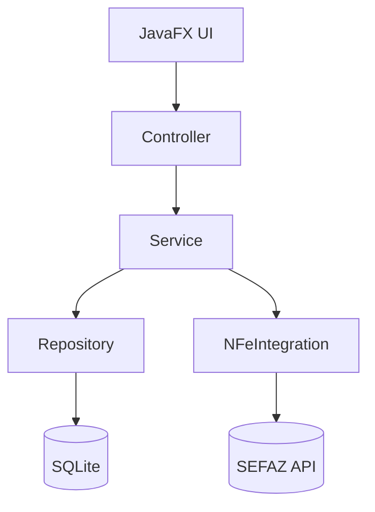
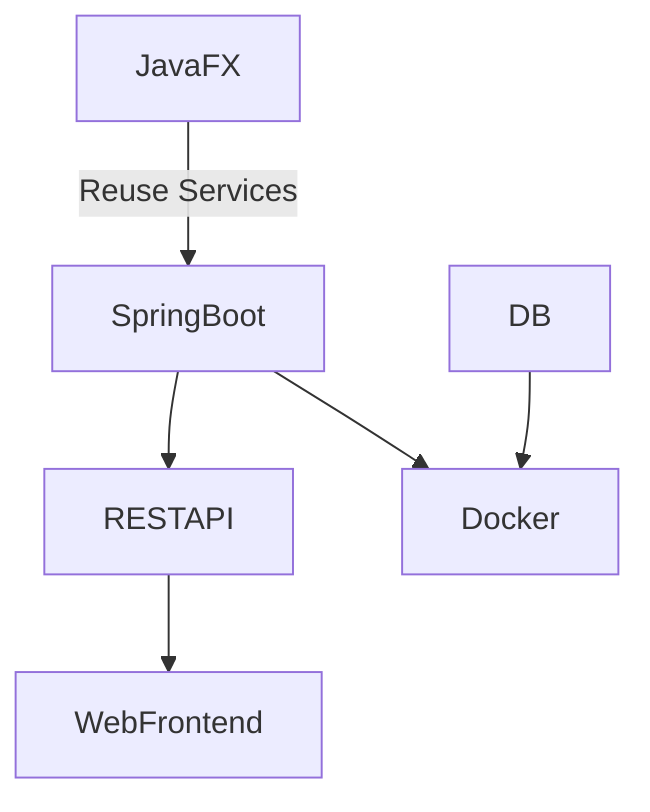

# Restaurant Management Prototype (JavaFX + Java 8)

## 1. Overview

This project is a **desktop monolith application** built with:

* Java 8
* JavaFX
* Maven
* SQLite (embedded database)

Modules:

* Menu Management
* Customer Management
* NFe/SAT (initially mocked)

---

## 2. Project Structure

```
restaurant-management/
│── pom.xml
│── src/
│   ├── main/
│   │   ├── java/com/akeir/restaurant/
│   │   │   ├── App.java
│   │   │   ├── config/
│   │   │   ├── controller/
│   │   │   ├── service/
│   │   │   ├── repository/
│   │   │   ├── model/
│   │   │   ├── dto/
│   │   │   ├── util/
│   │   │   └── integration/
│   │   │       └── nfe/
│   │   └── resources/
│   │       ├── fxml/
│   │       ├── css/
│   │       └── db/
│   └── test/
```

---

## 3. Maven (pom.xml)

```xml
<project xmlns="http://maven.apache.org/POM/4.0.0"
         xmlns:xsi="http://www.w3.org/2001/XMLSchema-instance"
         xsi:schemaLocation="http://maven.apache.org/POM/4.0.0 http://maven.apache.org/xsd/maven-4.0.0.xsd">

    <modelVersion>4.0.0</modelVersion>

    <groupId>com.akeir</groupId>
    <artifactId>restaurant-management</artifactId>
    <version>1.0-SNAPSHOT</version>

    <properties>
        <maven.compiler.source>1.8</maven.compiler.source>
        <maven.compiler.target>1.8</maven.compiler.target>
        <project.build.sourceEncoding>UTF-8</project.build.sourceEncoding>
    </properties>

    <dependencies>
        <!-- SQLite -->
        <dependency>
            <groupId>org.xerial</groupId>
            <artifactId>sqlite-jdbc</artifactId>
            <version>3.45.1.0</version>
        </dependency>

        <!-- Lombok (optional but useful) -->
        <dependency>
            <groupId>org.projectlombok</groupId>
            <artifactId>lombok</artifactId>
            <version>1.18.30</version>
            <scope>provided</scope>
        </dependency>

        <!-- Logging -->
        <dependency>
            <groupId>org.slf4j</groupId>
            <artifactId>slf4j-simple</artifactId>
            <version>2.0.9</version>
        </dependency>
    </dependencies>

    <build>
        <plugins>
            <plugin>
                <groupId>org.apache.maven.plugins</groupId>
                <artifactId>maven-compiler-plugin</artifactId>
                <version>3.11.0</version>
            </plugin>
        </plugins>
    </build>

</project>
```

---

## 4. Core Classes (Skeleton)

### App.java

```java
package com.akeir.restaurant;

import javafx.application.Application;
import javafx.fxml.FXMLLoader;
import javafx.scene.Parent;
import javafx.scene.Scene;
import javafx.stage.Stage;

public class App extends Application {

    @Override
    public void start(Stage primaryStage) throws Exception {
        Parent root = FXMLLoader.load(getClass().getResource("/fxml/main.fxml"));
        primaryStage.setTitle("Restaurant Management");
        primaryStage.setScene(new Scene(root));
        primaryStage.show();
    }

    public static void main(String[] args) {
        launch(args);
    }
}
```

---

## 5. Architecture (High-Level)



### Layers

* **Controller** → Handles UI interaction
* **Service** → Business rules
* **Repository** → Data access (DAO pattern)
* **Integration** → External services (NFe)

---

## 6. Future Evolution Path



---

## 7. Jira Planning (Epics & Tasks)

### EPIC 1 - Project Setup

* Create Maven project
* Configure Java 8
* Setup base package structure
* Add dependencies (SQLite, logging)
* Create initial JavaFX window

---

### EPIC 2 - Database Layer

* Create SQLite connection manager
* Define schema (menu, customers, orders)
* Implement base repository pattern
* Create migration/init script

---

### EPIC 3 - Menu Management

* Create MenuItem model
* Implement MenuRepository
* Implement MenuService
* Create UI for menu listing
* Create UI for add/edit/delete

---

### EPIC 4 - Customer Management

* Create Customer model
* Implement CustomerRepository
* Implement CustomerService
* Create UI for customer CRUD

---

### EPIC 5 - Skipped

<!-- This will not be implemented right now, skip it
### EPIC 5 - Order / Sales Flow (Basic)

* Create Order model
* Create OrderItem model
* Implement OrderService
* Create simple order screen
* Persist orders
-->

---

### EPIC 6 - NFe Integration (Mock First)

* Create NFeService interface
* Implement MockNFeService
* Simulate emission
* Log XML output

---

### EPIC 7 - Real NFe Integration

* Integrate library (ACBr or similar)
* Configure certificate
* Implement real emission
* Handle errors and retries

---

### EPIC 8 - Backup & Reliability

* Implement automatic DB backup
* Add manual backup option
* Add logging improvements

---

### EPIC 9 - Packaging & Delivery

* Configure jpackage
* Generate executable (.exe)
* Test on clean machine
* Create simple installer guide

---

## 8. Notes & Best Practices

* Keep services independent from UI
* Avoid JavaFX code inside service layer
* Use DTOs if needed
* Log everything important (especially NFe)
* Always ensure offline-first behavior

---

## 9. Next Steps

1. Create project using this structure
2. Run JavaFX window
3. Implement database connection
4. Start Menu module

---

## 10. Initial Database Schema (SQLite)

```sql
-- Enable foreign keys
PRAGMA foreign_keys = ON;

-- =========================
-- CUSTOMERS
-- =========================
CREATE TABLE IF NOT EXISTS customers (
    id              INTEGER PRIMARY KEY AUTOINCREMENT,
    name            TEXT NOT NULL,
    document        TEXT,               -- CPF/CNPJ
    email           TEXT,
    phone           TEXT,
    created_at      DATETIME DEFAULT CURRENT_TIMESTAMP,
    updated_at      DATETIME
);

CREATE INDEX IF NOT EXISTS idx_customers_document ON customers(document);

-- =========================
-- MENU / PRODUCTS
-- =========================
CREATE TABLE IF NOT EXISTS menu_items (
    id              INTEGER PRIMARY KEY AUTOINCREMENT,
    name            TEXT NOT NULL,
    description     TEXT,
    price           REAL NOT NULL,
    active          INTEGER NOT NULL DEFAULT 1, -- 1=true, 0=false
    created_at      DATETIME DEFAULT CURRENT_TIMESTAMP,
    updated_at      DATETIME
);

CREATE INDEX IF NOT EXISTS idx_menu_items_active ON menu_items(active);

-- Optional categories (keep simple for now)
CREATE TABLE IF NOT EXISTS categories (
    id          INTEGER PRIMARY KEY AUTOINCREMENT,
    name        TEXT NOT NULL
);

ALTER TABLE menu_items ADD COLUMN category_id INTEGER REFERENCES categories(id);

-- =========================
-- ORDERS
-- =========================
CREATE TABLE IF NOT EXISTS orders (
    id              INTEGER PRIMARY KEY AUTOINCREMENT,
    customer_id     INTEGER,
    status          TEXT NOT NULL, -- OPEN, PAID, CANCELLED
    total_amount    REAL NOT NULL DEFAULT 0,
    created_at      DATETIME DEFAULT CURRENT_TIMESTAMP,
    updated_at      DATETIME,

    FOREIGN KEY (customer_id) REFERENCES customers(id)
);

CREATE INDEX IF NOT EXISTS idx_orders_customer ON orders(customer_id);
CREATE INDEX IF NOT EXISTS idx_orders_status ON orders(status);

-- =========================
-- ORDER ITEMS
-- =========================
CREATE TABLE IF NOT EXISTS order_items (
    id              INTEGER PRIMARY KEY AUTOINCREMENT,
    order_id        INTEGER NOT NULL,
    menu_item_id    INTEGER NOT NULL,
    quantity        INTEGER NOT NULL,
    unit_price      REAL NOT NULL,
    total_price     REAL NOT NULL,

    FOREIGN KEY (order_id) REFERENCES orders(id) ON DELETE CASCADE,
    FOREIGN KEY (menu_item_id) REFERENCES menu_items(id)
);

CREATE INDEX IF NOT EXISTS idx_order_items_order ON order_items(order_id);

-- =========================
-- PAYMENTS (simple version)
-- =========================
CREATE TABLE IF NOT EXISTS payments (
    id              INTEGER PRIMARY KEY AUTOINCREMENT,
    order_id        INTEGER NOT NULL,
    method          TEXT NOT NULL, -- CASH, CARD, PIX
    amount          REAL NOT NULL,
    created_at      DATETIME DEFAULT CURRENT_TIMESTAMP,

    FOREIGN KEY (order_id) REFERENCES orders(id) ON DELETE CASCADE
);

-- =========================
-- NFE / SAT (BASIC TRACKING)
-- =========================
CREATE TABLE IF NOT EXISTS fiscal_documents (
    id              INTEGER PRIMARY KEY AUTOINCREMENT,
    order_id        INTEGER NOT NULL,
    type            TEXT NOT NULL, -- NFE, SAT
    status          TEXT NOT NULL, -- PENDING, AUTHORIZED, REJECTED
    access_key      TEXT,
    xml             TEXT,
    error_message   TEXT,
    created_at      DATETIME DEFAULT CURRENT_TIMESTAMP,

    FOREIGN KEY (order_id) REFERENCES orders(id)
);

CREATE INDEX IF NOT EXISTS idx_fiscal_order ON fiscal_documents(order_id);

-- =========================
-- INITIAL DATA (OPTIONAL)
-- =========================
INSERT INTO categories (name) VALUES ('Food'), ('Drinks');

INSERT INTO menu_items (name, description, price, category_id)
VALUES
('Burger', 'Basic burger', 25.0, 1),
('Soda', '350ml can', 6.0, 2);

```

### Notes

* Prices use REAL for simplicity (you may switch to integer cents later for precision)
* `status` fields are TEXT for flexibility (can evolve to enums in code)
* `xml` stored as TEXT for NFe (fine for SQLite prototype)
* Foreign keys are enforced (important!)

---

**End of Document**

